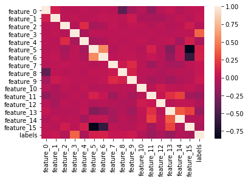

# <font color='PURPLE'>Ciência dos Dados na Prática</font>

# <font color='GREY'> Prevendo Evasão de clientes das Seguradoras </font>


As seguradoras em todo o mundo operam em um ambiente muito **competitivo**


Com vários aspectos de dados coletados de milhões de clientes, é extremamente difícil analisar e **entender o motivo da decisão** de um cliente de mudar para um provedor de seguros diferente. 


Para uma indústria em que a aquisição e retenção de clientes são igualmente importantes, e a primeira sendo um processo mais caro, **as seguradoras contam com OS DADOS para entender o comportamento do cliente e aumentar a retenção**. 


Assim, **saber se um cliente possivelmente quer cancelar o seguro** de antemão dá às seguradoras a oportunidade de **criar estratégias para evitar** que isso realmente aconteça. 


#1° Problema de Negócio


Seu objetivo como cientista de dados é construir um modelo de aprendizado de máquina, uma Máquina Preditiva, que possa **prever se a seguradora perderá um cliente ou não**. Você recebe 16 variáveis anônimas (feature_0 a feature 15) que influenciam a rotatividade de clientes no setor de seguros.


```python
# Mapeamento de Pacotes
import pandas as pd
import seaborn as sns
import lightgbm as lgb
from sklearn.metrics import f1_score, accuracy_score
from sklearn.model_selection import train_test_split
```


```python
# Versão da Linguagem Python
from platform import python_version
print('Versão da Linguagem Python Usada Neste script:', python_version())

#Alertas
import warnings
import sys
warnings.simplefilter(action='ignore', category=FutureWarning)
warnings.filterwarnings("ignore", category=FutureWarning)
if not sys.warnoptions:
    warnings.simplefilter("ignore")


```

    Versão da Linguagem Python Usada Neste script: 3.8.5


#2° Análise Exploratória dos Dados


###Fonte de Dados:
https://www.machinehack.com/hackathons/insurance_churn_prediction_weekend_hackathon_2/leaderboard


```python
#Importando os Dados
df_train = pd.read_csv('Train.csv')
```


```python
#Visualizando as 5 primeiras linhas
df_train.head(5)
```


<div>
<style scoped>
    .dataframe tbody tr th:only-of-type {
        vertical-align: middle;
    }

    .dataframe tbody tr th {
        vertical-align: top;
    }

    .dataframe thead th {
        text-align: right;
    }
</style>
<table border="1" class="dataframe">
  <thead>
    <tr style="text-align: right;">
      <th></th>
      <th>feature_0</th>
      <th>feature_1</th>
      <th>feature_2</th>
      <th>feature_3</th>
      <th>feature_4</th>
      <th>feature_5</th>
      <th>feature_6</th>
      <th>feature_7</th>
      <th>feature_8</th>
      <th>feature_9</th>
      <th>feature_10</th>
      <th>feature_11</th>
      <th>feature_12</th>
      <th>feature_13</th>
      <th>feature_14</th>
      <th>feature_15</th>
      <th>labels</th>
    </tr>
  </thead>
  <tbody>
    <tr>
      <th>0</th>
      <td>-0.276515</td>
      <td>-0.424429</td>
      <td>1.344997</td>
      <td>-0.012283</td>
      <td>0.076230</td>
      <td>1.076648</td>
      <td>0.182198</td>
      <td>3</td>
      <td>0</td>
      <td>1</td>
      <td>0</td>
      <td>0</td>
      <td>0</td>
      <td>0</td>
      <td>10</td>
      <td>2</td>
      <td>1</td>
    </tr>
    <tr>
      <th>1</th>
      <td>0.853573</td>
      <td>0.150991</td>
      <td>0.503892</td>
      <td>-0.979179</td>
      <td>-0.569351</td>
      <td>-0.411453</td>
      <td>-0.251940</td>
      <td>4</td>
      <td>1</td>
      <td>2</td>
      <td>0</td>
      <td>1</td>
      <td>0</td>
      <td>0</td>
      <td>0</td>
      <td>3</td>
      <td>0</td>
    </tr>
    <tr>
      <th>2</th>
      <td>0.947747</td>
      <td>-0.173832</td>
      <td>1.825628</td>
      <td>-0.703478</td>
      <td>0.076230</td>
      <td>-0.411453</td>
      <td>-0.251940</td>
      <td>6</td>
      <td>1</td>
      <td>2</td>
      <td>0</td>
      <td>0</td>
      <td>0</td>
      <td>0</td>
      <td>5</td>
      <td>3</td>
      <td>0</td>
    </tr>
    <tr>
      <th>3</th>
      <td>0.853573</td>
      <td>-0.381404</td>
      <td>0.984523</td>
      <td>-0.039464</td>
      <td>-0.569351</td>
      <td>-0.411453</td>
      <td>-0.251940</td>
      <td>4</td>
      <td>0</td>
      <td>2</td>
      <td>0</td>
      <td>1</td>
      <td>0</td>
      <td>0</td>
      <td>5</td>
      <td>3</td>
      <td>0</td>
    </tr>
    <tr>
      <th>4</th>
      <td>1.324443</td>
      <td>1.590527</td>
      <td>-1.178318</td>
      <td>-0.097711</td>
      <td>-0.246560</td>
      <td>-0.411453</td>
      <td>-0.251940</td>
      <td>0</td>
      <td>1</td>
      <td>1</td>
      <td>0</td>
      <td>0</td>
      <td>0</td>
      <td>0</td>
      <td>8</td>
      <td>3</td>
      <td>0</td>
    </tr>
  </tbody>
</table>
</div>


```python
#Contagem de Domínios Distintos
df_train.nunique()
```


    feature_0       77
    feature_1     6434
    feature_2       31
    feature_3     1482
    feature_4       47
    feature_5      517
    feature_6       36
    feature_7       12
    feature_8        3
    feature_9        4
    feature_10       2
    feature_11       2
    feature_12       2
    feature_13       3
    feature_14      12
    feature_15       4
    labels           2
    dtype: int64


```python
#Verifica Valores Nulos
df_train.isna().sum()
```


    feature_0     0
    feature_1     0
    feature_2     0
    feature_3     0
    feature_4     0
    feature_5     0
    feature_6     0
    feature_7     0
    feature_8     0
    feature_9     0
    feature_10    0
    feature_11    0
    feature_12    0
    feature_13    0
    feature_14    0
    feature_15    0
    labels        0
    dtype: int64


```python
#Verifica Registros Duplicados
df_train.duplicated().sum()
```


    0


```python
#Estatística Descritiva dos Campos
df_train.describe()
```


<div>
<style scoped>
    .dataframe tbody tr th:only-of-type {
        vertical-align: middle;
    }

    .dataframe tbody tr th {
        vertical-align: top;
    }

    .dataframe thead th {
        text-align: right;
    }
</style>
<table border="1" class="dataframe">
  <thead>
    <tr style="text-align: right;">
      <th></th>
      <th>feature_0</th>
      <th>feature_1</th>
      <th>feature_2</th>
      <th>feature_3</th>
      <th>feature_4</th>
      <th>feature_5</th>
      <th>feature_6</th>
      <th>feature_7</th>
      <th>feature_8</th>
      <th>feature_9</th>
      <th>feature_10</th>
      <th>feature_11</th>
      <th>feature_12</th>
      <th>feature_13</th>
      <th>feature_14</th>
      <th>feature_15</th>
      <th>labels</th>
    </tr>
  </thead>
  <tbody>
    <tr>
      <th>count</th>
      <td>33908.000000</td>
      <td>33908.000000</td>
      <td>33908.000000</td>
      <td>33908.000000</td>
      <td>33908.000000</td>
      <td>33908.000000</td>
      <td>33908.000000</td>
      <td>33908.000000</td>
      <td>33908.000000</td>
      <td>33908.000000</td>
      <td>33908.000000</td>
      <td>33908.000000</td>
      <td>33908.000000</td>
      <td>33908.000000</td>
      <td>33908.000000</td>
      <td>33908.000000</td>
      <td>33908.000000</td>
    </tr>
    <tr>
      <th>mean</th>
      <td>-0.004158</td>
      <td>0.002584</td>
      <td>-0.000213</td>
      <td>-0.000053</td>
      <td>-0.000298</td>
      <td>-0.004652</td>
      <td>-0.007498</td>
      <td>4.336381</td>
      <td>1.171051</td>
      <td>1.225345</td>
      <td>0.018137</td>
      <td>0.555503</td>
      <td>0.159667</td>
      <td>0.639407</td>
      <td>5.520497</td>
      <td>2.562375</td>
      <td>0.116993</td>
    </tr>
    <tr>
      <th>std</th>
      <td>0.999776</td>
      <td>1.014268</td>
      <td>1.000872</td>
      <td>1.002512</td>
      <td>1.003724</td>
      <td>0.993984</td>
      <td>0.802696</td>
      <td>3.273376</td>
      <td>0.606730</td>
      <td>0.749104</td>
      <td>0.133450</td>
      <td>0.496917</td>
      <td>0.366303</td>
      <td>0.897627</td>
      <td>3.003241</td>
      <td>0.987148</td>
      <td>0.321417</td>
    </tr>
    <tr>
      <th>min</th>
      <td>-2.159994</td>
      <td>-3.081149</td>
      <td>-1.779108</td>
      <td>-1.002478</td>
      <td>-0.569351</td>
      <td>-0.411453</td>
      <td>-0.251940</td>
      <td>0.000000</td>
      <td>0.000000</td>
      <td>0.000000</td>
      <td>0.000000</td>
      <td>0.000000</td>
      <td>0.000000</td>
      <td>0.000000</td>
      <td>0.000000</td>
      <td>0.000000</td>
      <td>0.000000</td>
    </tr>
    <tr>
      <th>25%</th>
      <td>-0.747384</td>
      <td>-0.422787</td>
      <td>-0.938003</td>
      <td>-0.602517</td>
      <td>-0.569351</td>
      <td>-0.411453</td>
      <td>-0.251940</td>
      <td>1.000000</td>
      <td>1.000000</td>
      <td>1.000000</td>
      <td>0.000000</td>
      <td>0.000000</td>
      <td>0.000000</td>
      <td>0.000000</td>
      <td>3.000000</td>
      <td>3.000000</td>
      <td>0.000000</td>
    </tr>
    <tr>
      <th>50%</th>
      <td>-0.182341</td>
      <td>-0.297324</td>
      <td>0.023260</td>
      <td>-0.303517</td>
      <td>-0.246560</td>
      <td>-0.411453</td>
      <td>-0.251940</td>
      <td>4.000000</td>
      <td>1.000000</td>
      <td>1.000000</td>
      <td>0.000000</td>
      <td>1.000000</td>
      <td>0.000000</td>
      <td>0.000000</td>
      <td>6.000000</td>
      <td>3.000000</td>
      <td>0.000000</td>
    </tr>
    <tr>
      <th>75%</th>
      <td>0.665225</td>
      <td>0.022901</td>
      <td>0.624050</td>
      <td>0.236237</td>
      <td>0.076230</td>
      <td>-0.411453</td>
      <td>-0.251940</td>
      <td>7.000000</td>
      <td>2.000000</td>
      <td>2.000000</td>
      <td>0.000000</td>
      <td>1.000000</td>
      <td>0.000000</td>
      <td>2.000000</td>
      <td>8.000000</td>
      <td>3.000000</td>
      <td>0.000000</td>
    </tr>
    <tr>
      <th>max</th>
      <td>5.091402</td>
      <td>33.094776</td>
      <td>1.825628</td>
      <td>18.094700</td>
      <td>19.443647</td>
      <td>8.127648</td>
      <td>23.625644</td>
      <td>11.000000</td>
      <td>2.000000</td>
      <td>3.000000</td>
      <td>1.000000</td>
      <td>1.000000</td>
      <td>1.000000</td>
      <td>2.000000</td>
      <td>11.000000</td>
      <td>3.000000</td>
      <td>1.000000</td>
    </tr>
  </tbody>
</table>
</div>


```python
#Estatística da Label (target.....Y.....Variável dependente.....caraca é nome demais p mesma coisa)
df_train['labels'].value_counts(normalize=True)
sns.countplot(df_train['labels'])
```


    <AxesSubplot:xlabel='labels', ylabel='count'>


    

    


```python
#Estatística dos Campos
df_train['feature_2'].value_counts()
sns.boxplot(df_train['feature_2'])
```


    <AxesSubplot:xlabel='feature_2'>


    

    


```python
#Estatística dos Campos
df_train['feature_3'].value_counts()
sns.histplot(df_train['feature_3'], bins=50)
```


    <AxesSubplot:xlabel='feature_3', ylabel='Count'>


    

    


```python
#Estatística dos Campos
df_train['feature_5'].value_counts()
sns.histplot(df_train['feature_5'], bins=50)
```


    <AxesSubplot:xlabel='feature_5', ylabel='Count'>


    

    


```python
#Estatística dos Campos
df_train['feature_11'].value_counts()
sns.countplot(df_train['feature_11'])
```


    <AxesSubplot:xlabel='feature_11', ylabel='count'>


    

    


```python
#Estatística dos Campos
df_train['feature_13'].value_counts()
sns.countplot(df_train['feature_13'])
```


    <AxesSubplot:xlabel='feature_13', ylabel='count'>


    

    


```python
#Estatística dos Campos
df_train['feature_14'].value_counts()
sns.countplot(df_train['feature_14'])
```


    <AxesSubplot:xlabel='feature_14', ylabel='count'>


    

    


```python
#Estatística dos Campos
df_train['feature_15'].value_counts()
sns.countplot(df_train['feature_15'])
```


    <AxesSubplot:xlabel='feature_15', ylabel='count'>


    

    


```python
#Mapa de Correlação das Variáveis(features)
corr = df_train.corr()
sns.heatmap(corr)
```


    <AxesSubplot:>


    

    


#3° Pré-Processamento dos Dados

### **Balanceamento** **da** **Classe**
O conjunto de dados está altamente desbalanceado e precisa de tratamento. Vamos usar uma **Hiperparâmetro** do Algoritmo ao invés de usar funções específicas como o SMOTE.

### **Seleção das Variáveis - Feature Select**


```python
#Separando os valores para realizar o Treinamento 
array = df_train.values
```


```python
# Separando o array em componentes de input e output (variáveis explicativas e Target(Y))
X = array[:, [2,3,5,11,13,14,15]]
Y = array[:,16]
```


```python
# Definindo o tamanho dos dados de treino e de teste
teste_size = 0.38
seed = 7


```


```python
# Criando o dataset de treino e de teste
X_treino, X_teste, y_treino, y_teste = train_test_split(X, Y, test_size = teste_size, random_state = seed)

```

#4° Construíndo a Máquina Preditiva 


```python
# Criando a Máquina Preditiva
modelo = lgb.LGBMClassifier(
                            n_estimators=95,
                            learning_rate=0.1,
                            scale_pos_weight=3, 
                            random_state=7,
                           )


```

### **Explicando os Hiperparâmetros**


"**scale_pos_weight**":  
Controle o saldo de pesos positivos e negativos, útil para classes **desbalanceadas**.
Geralmente, o Scale_pos_weight é a proporção do número de classe negativa para a classe positiva. Suponha que o conjunto de dados possua 90 observações da classe negativa e 10 observações da classe positiva; o valor ideal de scale_pos_Weight pode ser 9.

https://lightgbm.readthedocs.io/en/latest/Parameters.html


**"learning_rate"**
É um parâmetro de ajuste em um algoritmo de otimização que determina o tamanho da etapa em cada iteração enquanto se move em direção a um mínimo de uma função de perda.
Metaforicamente é a velocidade com que um modelo de aprendizado de máquina "aprende" Costumo usar valores entre [0001, 0.001, 0.01, 0.1, 0.2, 0.3]

**"n_estimators"**É o número de árvores de decisão.

"**random_state**"É uma semente aleatória para gerar os mesmos valores que os meus.


```python
# Treinando o modelo
modelo.fit(X_treino, y_treino)

# Pront do modelo
print(modelo)

# Fazendo previsões
y_pred = modelo.predict(X_teste)
previsoes = [round(value) for value in y_pred]


```

    LGBMClassifier(n_estimators=95, random_state=7, scale_pos_weight=3)


#5° Avaliação da Máquina Preditiva


```python
# Avaliando com a Métrica Acurácia
accuracy = accuracy_score(y_teste, previsoes)
print("Acurácia: %.2f%%" % (accuracy * 100.0))
```

    Acurácia: 89.59%


```python
# Avaliando com a Métrica da Competição F1_Score
F1 = f1_score(y_teste, previsoes)
F1
```


    0.6286662977310459


# Entre os 17 Primeiros do Mundo na Competição!
https://www.machinehack.com/hackathons/insurance_churn_prediction_weekend_hackathon_2/leaderboard


# **Resumão**


* Nesta aula, aprendemos a **Criar Máquina Preditiva** que prevê a se o Cliente quer Abandonar a Seguradora....
* Mais 1 Case com **LightGBM**
* **Hiperparâmetros**
* Seleção de Variáveis - **Feature Selection**
* Ficamos entre os 18 primeiros colocados na competição


#Fim

## Valeu!

### #Links - Ciência dos Dados <a href="https://linktr.ee/cienciadosdados">https://linktr.ee/cienciadosdados</a>

### #YouTube - Mais Aulas como essa no YouTube <a href="https://www.youtube.com/watch?v=IaIc5oHd3II&t=1569s">https://www.youtube.com/watch?v=IaIc5oHd3II&t=1569s</a>


```python
from IPython.core.display import HTML
HTML('<iframe width="380" height="202" src="https://www.youtube.com/embed/vp_-ZIUst6c" frameborder="0" allow="accelerometer; autoplay; clipboard-write; encrypted-media; gyroscope; picture-in-picture" allowfullscreen></iframe>')
```


<iframe width="380" height="202" src="https://www.youtube.com/embed/vp_-ZIUst6c" frameborder="0" allow="accelerometer; autoplay; clipboard-write; encrypted-media; gyroscope; picture-in-picture" allowfullscreen></iframe>


